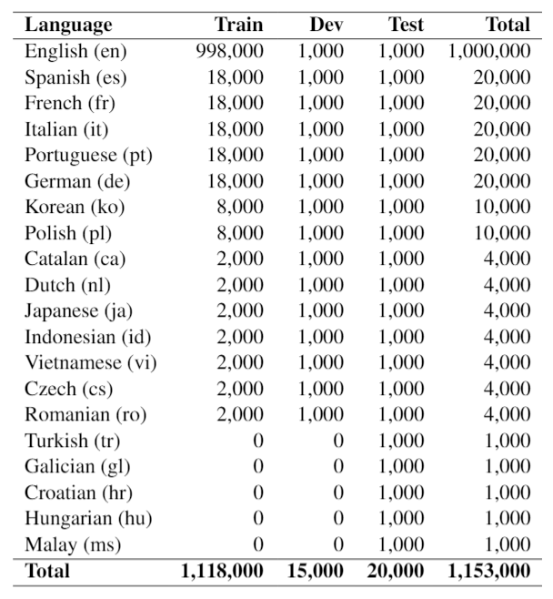
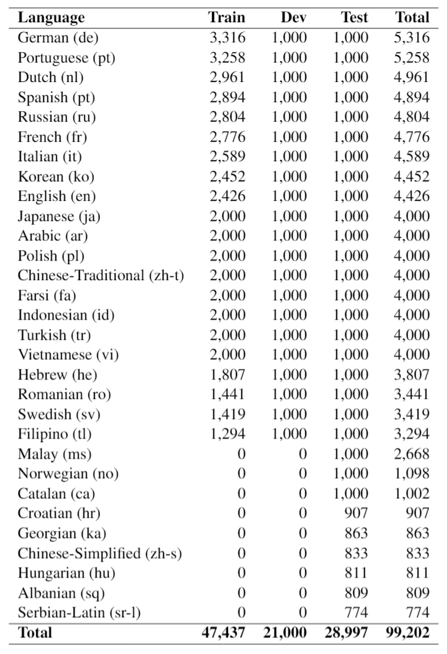

# GEM: A General Evaluation Benchmark for Multimodal Tasks
[**Tasks**](#tasks) |
[**Dataset**](#get-dataset) |
[**Leaderboard**](https://fuzzy-robot-fa0b9e30.pages.github.io/) |
[**Paper**](TBD)

## Introduction
This repository contains information about the general multi-modal evaluation benchmark GEM, which is composed of GEM-I for image tasks spans 20 languages and GEM-V for video tasks spans 30 languages.
The current version of GEM is composed of 8 tasks. For each task, training and validation set are provided. GEM is not only the largest vision-language dataset covering image-language tasks and video-language tasks at the same time, but also labeled in multiple languages.

### GEM-I
GEM-I contains 1.2 million {Query, Image, Title} triplets in 20 different languages for text-to-image retrieval and image captioning tasks. The statistics can be found in below table.





### GEM-V
GEM-V contains 99K {Query, Video, Title} triplets in 30 languages for text-to-video retrieval and video captioning tasks. The statistics can be found in below table.




## Tasks
The 8 tasks in GEM can be categorized into 4 groups: image retrieval tasks, image captioning tasks, video retrieval tasks and video captioning tasks.

### Image Retrieval Tasks

#### Query -> Image Retrieval
Within each language, we use query to retrieve images, and the evaluation metric is mean-Recall (arithmetic mean of Recall@K for K in {1, 5, 10}).

#### Query -> Image+Title Retrieval
Within each language, we use query to retrieve images with title as context, and the evaluation metric is mean-Recall (arithmetic mean of Recall@K for K ∈ {1, 5, 10}).

### Image Captioning Tasks

#### Image -> Query Captioning
We use image to generate caption text, and use ROUGE-L as the evaluation metric.


### Video Retrieval Tasks

#### Query -> Video Retrieval
Within each language, we use query to retrieve videos, and the evaluation metric is mean-Recall (arithmetic mean of Recall@K for K in {1, 5, 10}).

#### Query -> Video+Title Retrieval
Within each language, we use query to retrieve videos with title as context, and the evaluation metric is mean-Recall (arithmetic mean of Recall@K for K in {1, 5, 10}).

### Video Captioning Tasks

#### Video -> Query Captioning
We use video to generate caption text, and use ROUGE-L as the evaluation metric.

#### Title -> Query Captioning
We use Title to generate caption text, and use ROUGE-L as the evaluation metric.

#### Video+Title-> Query Captioning
We use video and title to generate caption text, and use ROUGE-L as the evaluation metric.

## Get Dataset
In order to use our dataset, please navigate to [GEM Leaderboard](https://fuzzy-robot-fa0b9e30.pages.github.io/) and agree to our terms of service. After you do so a download link will be made available.

## Leaderboard Submission
### Submissions
To submit your predictions for evaluation, please create a single folder which contains the 11 sub-folders named after each task (see [reference file](evaluation/M3P_prediction_on_GEM_test) for an example). 
Inside each folder, create one prediction file for each language and name the file using the following format: `{language}.prediction` where `{language}` is the 2 character [ISO 639-1](https://en.wikipedia.org/wiki/List_of_ISO_639-1_codes) code.
Please validate that you have done this correctly by evaluating against the development file. Once that is done <a href='GEM-team@microsoft.com'>email your submission</a>. We will reply with your model performance.

### Evaluation
To evaluate your model's performance, we will compare your prediction files with the ground truth files.
We are keeping our evaluation data held out but we ask all models first evaluate performance on the development portion of the dataset before submitting their predictions for the evaluation dataset.
To evaluate your performance, please use the following command: 
```
python GEM_evaluate.py --prediction_dir <prediction_files_folder> --ground_truth_dir <ground_truth_dir> --tasks QIR,QITR --split dev 
```

This file has several dependencies:
```
numpy
sklearn
seqeval
sacrebleu
```

The detailed format of each task is at [Evaluation ReadMe](./evaluation/README.md).
### Baseline
To aid your model comparison we have included the output of our baseline system, M3P.  Please find the [dev example](evaluation/M3P_prediction_on_GEM_dev) and [test example](evaluation/M3P_prediction_on_GEM_test).
## Paper
If you use our benchmark or dataset, please cite our paper `\cite{lin2021gem}`.
```
@inproceedings{lin2021gem,
    title = "{GEM}: A General Evaluation Benchmark for Multimodal Tasks",
    author = "Lin Su and Nan Duan and Edward Cui and Lei Ji and Chenfei Wu and Huaishao and Luo Yongfei Liu and Ming Zhong and Taroon Bharti and Arun Sacheti",
    booktitle = "Findings of the Association for Computational Linguistics",
    month = aug,
    year = "2021",
    address = "Online",
    publisher = "Association for Computational Linguistics",
    url = "",
    doi = "",
    pages = "",
    abstract = "",
}
```

## Contributing

This project welcomes contributions and suggestions.  Most contributions require you to agree to a
Contributor License Agreement (CLA) declaring that you have the right to, and actually do, grant us
the rights to use your contribution. For details, visit https://cla.opensource.microsoft.com.

When you submit a pull request, a CLA bot will automatically determine whether you need to provide
a CLA and decorate the PR appropriately (e.g., status check, comment). Simply follow the instructions
provided by the bot. You will only need to do this once across all repos using our CLA.

This project has adopted the [Microsoft Open Source Code of Conduct](https://opensource.microsoft.com/codeofconduct/).
For more information see the [Code of Conduct FAQ](https://opensource.microsoft.com/codeofconduct/faq/) or
contact [opencode@microsoft.com](mailto:opencode@microsoft.com) with any additional questions or comments.

## Trademarks

This project may contain trademarks or logos for projects, products, or services. Authorized use of Microsoft 
trademarks or logos is subject to and must follow 
[Microsoft's Trademark & Brand Guidelines](https://www.microsoft.com/en-us/legal/intellectualproperty/trademarks/usage/general).
Use of Microsoft trademarks or logos in modified versions of this project must not cause confusion or imply Microsoft sponsorship.
Any use of third-party trademarks or logos are subject to those third-party's policies.
